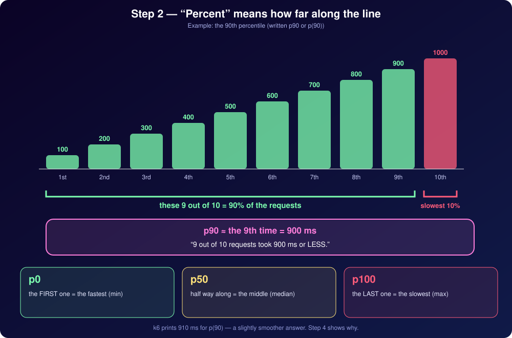

<!-- ══════════════════════════════════════════════════════════════════ -->
<!--                  k6 PERFORMANCE TESTING                          -->
<!--              ⚡ Knowledge Bundle — AI-Aided Learning ⚡           -->
<!-- ══════════════════════════════════════════════════════════════════ -->

<div align="center">


### ⚡ 6+ Hours of Structured Content · AI-Aided Learning · Zero to Production ⚡

[](https://github.com/GoogleCloudPlatform/knowledge-catalog/blob/main/okf/SPEC.md)
[](https://developer.mozilla.org/en-US/docs/Web/JavaScript)
[](https://grafana.com/docs/k6/latest/)
[](LICENSE)

</div>

---

## 🚀 What is this?

This is not a blog post. This is not a documentation dump.

This is a **structured, concept-by-concept knowledge bundle** for mastering **Grafana k6**
performance testing — built in the
[Open Knowledge Format (OKF v0.2)](https://github.com/GoogleCloudPlatform/knowledge-catalog/blob/main/okf/SPEC.md)
so you can point it directly at your LLM and learn with AI as your companion.

> **AI-Aided Learning** — feed this bundle to your favourite LLM (ChatGPT, Claude, Gemini…),
> ask questions, get explanations, run drills. The structured frontmatter and cross-linked
> concepts mean the AI always has the right context. That's what makes this different.

### 🌱 New to JavaScript? Start here — you're covered.

Every k6 test is written in JavaScript, and **you don't need to know it already**. The companion
**[JavaScript Knowledge Bundle](https://github.com/bhagatabhijeet/javascript-knowledge-bundle)** is a free,
open-source, ad-free learning path built in the same Open Knowledge Format — it takes you from
**complete beginner to confident intermediate**: variables, functions, objects and arrays, control flow,
promises, `async/await` and ES modules, with **runnable snippets, hand-built diagrams and a quiz** to check
yourself. Learn the language there, then come back here and write your first k6 load test with confidence.

[](https://github.com/bhagatabhijeet/javascript-knowledge-bundle)

---

## 💡 Why k6?

```
┌─────────────────────────────────────────────────────────────┐
│                                                             │
│   JMeter / LoadRunner          k6                           │
│   ─────────────────────        ──────────────────────────   │
│   ❌ Heavy GUI to install      ✅ Single binary, no GUI     │
│   ❌ XML config files          ✅ Plain JavaScript          │
│   ❌ Hard to version-control   ✅ Lives in your Git repo    │
│   ❌ Steep learning curve      ✅ First test in 5 minutes   │
│   ❌ No cloud-native story     ✅ Native Grafana Cloud       │
│                                                             │
└─────────────────────────────────────────────────────────────┘
```

k6 lets you write a load test in the same editor you write your application code.
Lightweight. Scriptable. CI/CD-ready from day one.

---

## 📐 Percentiles — finally explained like you’re in 10th grade

Everyone says “look at the p95”. Almost nobody explains **where p95 comes from**. This bundle does — slowly, with
pictures, using **ten friendly numbers** and nothing harder than adding, multiplying and dividing.

<div align="center">

</div>

- 📏 **Line them up** — why percentiles start with sorting
- 🧮 **“How far along the line?”** — what p90, p95 and p99 really mean
- ⚖️ **A seesaw** — why the average gets fooled by one slow request and the median doesn’t
- 🪜 **Walk the stairs** — the exact trick k6 uses when a percentile lands *between* two requests
- 📝 **A three-step recipe**, a worked cheat-sheet, three classic traps, and a self-check quiz

It lives in its own section — **Math for Performance Testers** — and every answer is **checked against a real k6 run** you can repeat yourself. 👉
[**Read “The Math of Percentiles — Explained Simply”**](math-for-performance-testers/percentile-math.md)

---

## 📚 What's inside — 6+ hours of content

```
┌─────────────────────────────────────────────────────────────────────┐
│  LEARNING PATH                                              ⏱ TIME  │
├─────────────────────────────────────────────────────────────────────┤
│  1 📖 Performance Testing Fundamentals                     ~45 min  │
│     └─ What is performance testing? What is k6?                     │
│     └─ Testing types: smoke, load, stress, spike, soak              │
├─────────────────────────────────────────────────────────────────────┤
│  2 🛠  k6 Setup                                             ~30 min  │
│     └─ Install k6, editor, project, k6 Studio, extensions           │
│     └─ IntelliSense & your first test                               │
├─────────────────────────────────────────────────────────────────────┤
│  3 ⚙️  k6 Core Concepts                                    ~90 min  │
│     └─ Expected responses, thresholds & stages                      │
│     └─ Reading the console, the math of percentiles                 │
│     └─ Architecture: Go, Sobek & the test lifecycle                 │
├─────────────────────────────────────────────────────────────────────┤
│  4 🔗 How to Test APIs Using k6                             ~60 min  │
│     └─ Requests, parameterisation & data-driven tests               │
│     └─ Assertions on responses                                      │
├─────────────────────────────────────────────────────────────────────┤
│  5 🧑‍💻 Building Load Scenarios for Functional API Tests    ~60 min  │
│     └─ Registration → login → checkout journeys                     │
│     └─ Measuring real user journeys under load                      │
├─────────────────────────────────────────────────────────────────────┤
│  6 🌐 Browser UI Testing with Playwright k6 Integration    ~45 min  │
│     └─ k6 browser module & Playwright-style scripting               │
│     └─ Capturing browser metrics                                    │
├─────────────────────────────────────────────────────────────────────┤
│  7 🎭 Building Load Scenarios for UI Tests                  ~45 min  │
│     └─ Browser scenarios at scale                                   │
│     └─ Mixing protocol and browser load                             │
├─────────────────────────────────────────────────────────────────────┤
│  8 ☁️  Building Load Tests for the Grafana Cloud Platform  ~45 min  │
│     └─ Streaming results, dashboards & reports                      │
│     └─ Running cloud-scale tests                                    │
├─────────────────────────────────────────────────────────────────────┤
│  9 🔄 CI/CD Integration                                     ~30 min  │
│     └─ Embedding k6 into pipelines                                  │
│     └─ Automated pass/fail on threshold breach                      │
├─────────────────────────────────────────────────────────────────────┤
│  10 📐 Math for Performance Testers                         ~30 min  │
│     └─ Percentiles explained like you're in 10th grade            │
│     └─ Averages, medians & the long tail                            │
└─────────────────────────────────────────────────────────────────────┘
                                              TOTAL  ≈ 8 hrs
```

---

## 🎯 How to use this bundle

### Option A — AI-Aided Learning (recommended)

```
1.  Clone or download this repo
        git clone https://github.com/bhagatabhijeet/k6-knowledge-bundle

2.  Open your LLM of choice (Claude, ChatGPT, Gemini, etc.)

3.  Point the LLM at a concept file:
        "Here is a knowledge concept: [paste file contents]
         Explain it to me, quiz me, and show me variations."

4.  Follow the learning path in order — each concept cross-links
    to the next, so the LLM always has the right context.

5.  Run the code snippets in assets/code/ as you go.
        k6 run assets/code/introduction-to-performance-testing/smoke-test.js
```

### Option B — Self-paced reading

Follow the topic order in [`index.md`](./index.md). Each topic folder has its own `index.md`
listing concepts in the recommended reading sequence.

---

## 🗺 Bundle map

```
k6-knowledge-bundle/
│
├── 📄 index.md                          ← Start here
├── 📄 log.md                            ← What changed and when
├── 📄 CONTRIBUTING.md                   ← Authoring rules (OKF v0.2)
│
├── 📁 introduction-to-performance-testing/
│   ├── index.md                         ← Topic overview
│   ├── what-is-performance-testing.md
│   ├── what-is-k6.md
│   ├── smoke-testing.md
│   ├── load-testing.md
│   ├── stress-testing.md
│   ├── spike-testing.md
│   ├── soak-testing.md
│   └── … more concepts coming
│
├── 📁 k6-setup/
│   ├── index.md
│   ├── installing-k6.md
│   ├── setting-up-the-editor.md
│   ├── creating-a-k6-project.md
│   ├── k6-studio.md
│   ├── k6-editor-extensions.md
│   └── debugging-k6-scripts.md
│
├── 📁 k6-configuration-options-in-code-editor/
│   ├── index.md
│   ├── enable-k6-intellisense.md
│   └── writing-your-first-k6-test.md
│
├── 📁 k6-console-output/
│   ├── index.md
│   ├── reading-the-k6-summary.md
│   ├── http-req-duration-and-percentiles.md
│   └── percentile-math.md
│
├── 📁 k6-core-concepts/
│   ├── index.md
│   ├── expected-responses.md
│   ├── thresholds.md
│   └── stages.md
│
├── 📁 math-for-performance-testers/
│   ├── index.md
│   └── percentile-math.md
│
├── 📁 k6-architecture/
│   ├── index.md
│   ├── how-k6-is-built.md
│   └── k6-test-lifecycle.md
│
└── 📁 assets/
    ├── images/                          ← Diagrams & visuals
    └── code/                            ← Runnable k6 scripts
        ├── introduction-to-performance-testing/
        │   ├── first-load-test.js
        │   ├── smoke-test.js
        │   ├── load-test.js
        │   ├── stress-test.js
        │   ├── spike-test.js
        │   ├── spike-test-arrival-rate.js
        │   └── soak-test.js
        ├── k6-setup/
        │   ├── hello-k6.js
        │   ├── studio-generated-example.js
        │   ├── debug-demo.js
        │   └── k6-tasks.json
        ├── k6-configuration-options-in-code-editor/
        │   ├── first-test.js
        │   └── first-test-missing-import.js
        ├── k6-console-output/
        │   └── percentile-demo.js
        ├── math-for-performance-testers/
        │   └── percentile-math-demo.js
        ├── k6-core-concepts/
        │   ├── expected-responses.js
        │   ├── global-expected-statuses.js
        │   ├── thresholds-demo.js
        │   ├── abort-on-fail.js
        │   └── stages-demo.js
        └── k6-architecture/
            └── test-lifecycle.js
```

---

## ⚡ Taste the content — your first k6 test

```js
// 👇 This is a complete, runnable k6 load test.
//    Save it, run: k6 run first-load-test.js

import http from 'k6/http';
import { sleep } from 'k6';

export const options = {
  vus: 10,         // 10 virtual users hammering your server simultaneously
  duration: '30s'  // for 30 seconds straight
};

export default function () {
  http.get('https://test.k6.io'); // 🎯 replace with your app's URL
  sleep(1);                       // think time — real users don't spam requests
}
```

> Run it: `k6 run first-load-test.js`
> k6 will print response times, request rates, and error counts — instantly.

---

## 🧱 Prerequisites

```
✅ Basic programming experience (any language)
✅ Familiarity with APIs is helpful but not required
✅ JavaScript basics — new to it? The JavaScript Knowledge Bundle (linked above) gets you there
✅ An open mind and curiosity about how systems behave under pressure
```

No GUI. No drag-and-drop. Just code, a terminal, and your curiosity.

---

## 🤝 Contributing & authoring

This bundle follows
[OKF v0.2](https://github.com/GoogleCloudPlatform/knowledge-catalog/blob/main/okf/SPEC.md).
Every concept file carries YAML frontmatter. See [`CONTRIBUTING.md`](./CONTRIBUTING.md) for
the full authoring guide — frontmatter schema, naming conventions, cross-linking rules, and
commit message format.

---

## 📜 License

MIT — use it, share it, point your AI at it.

---

<div align="center">


**Built with ❤️ using [OKF v0.2](https://github.com/GoogleCloudPlatform/knowledge-catalog/blob/main/okf/SPEC.md) · Powered by [Grafana k6](https://grafana.com/docs/k6/latest/)**

</div>
